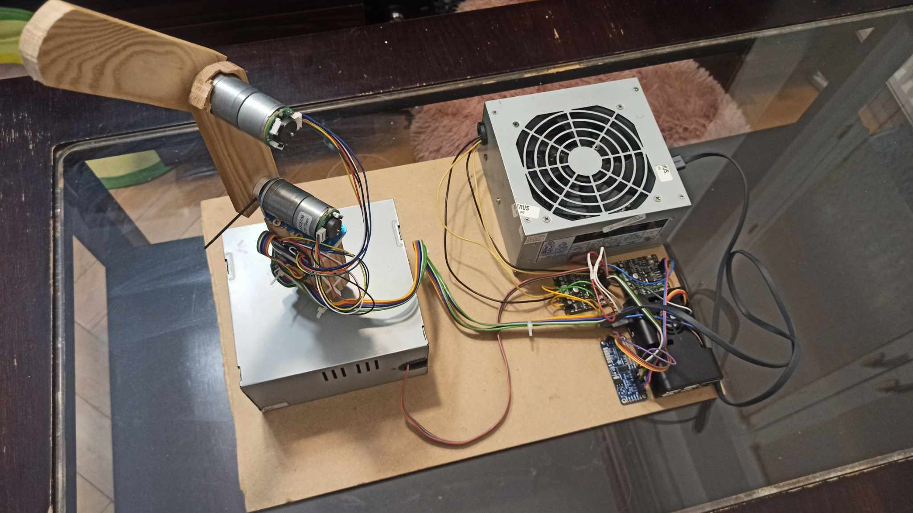
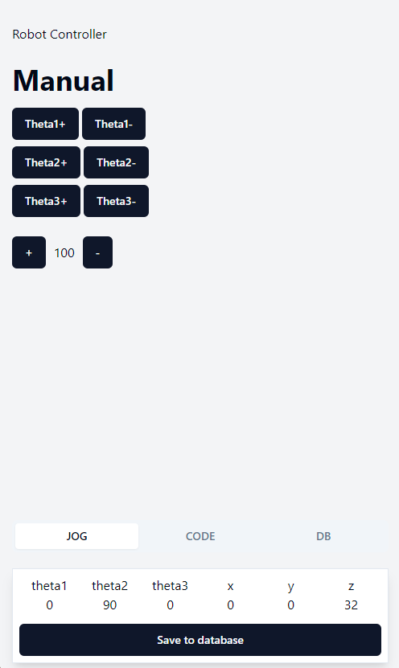
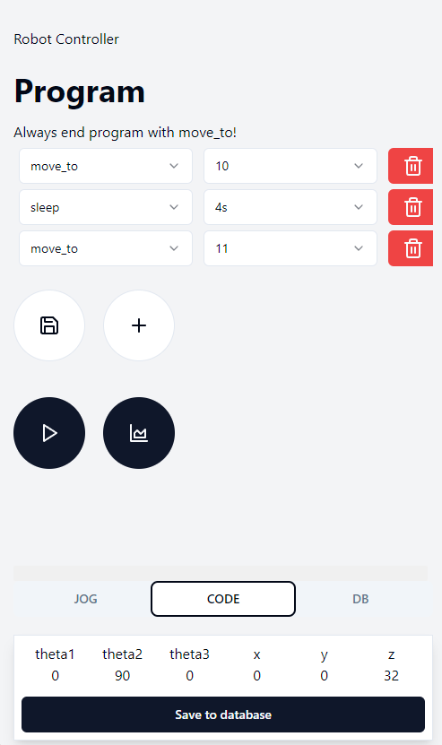
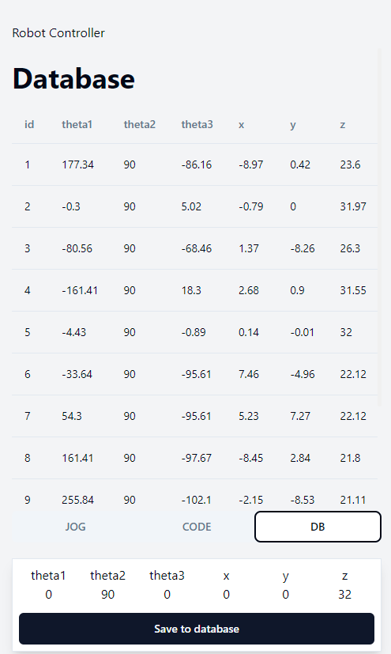
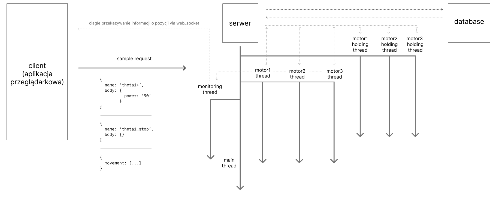

# Project of 3 degrees of freedom (RRR - rotate, rotate, rotate) manipulator

This project presents a full-stack implementation of a robotic arm with 3 degrees of freedom, controlled via a web interface. It integrates hardware control using a Raspberry Pi, along with software components utilizing Vue.js, Python, and Flask. This implementation showcases the use of I2C and PWM for motor control, Bezier curves for path planning, and both forward and inverse kinematics for movement calculations.

## Features

- **Manual Control**: Operate the robot in jog mode for manual control of each joint.
- **Program Execution**: Users can create and execute simple programs that the robot will follow.
- **Position Saving**: Save the current position of the robot to a database for later retrieval.
- **Position Holding**: Utilize PID control to maintain the robot's position when it is not actively moving.

  
  
  

## Technologies

- **Frontend**: Vue.js
- **Backend**: Python, Flask
- **Database**: SQLite
- **Libraries**: RPi.GPIO, adafruit_pca9685

## Hardware Components

- **Raspberry Pi**: Acts as the central control unit.
- **DC Motors**: Facilitate movement in the robotic joints.
- **I2C/PWM Interface**: Handled via Adafruit library for precise control over motor actions.
